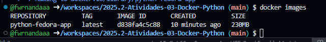
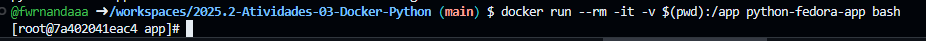
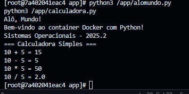
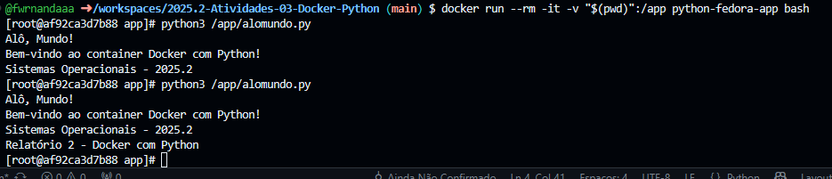
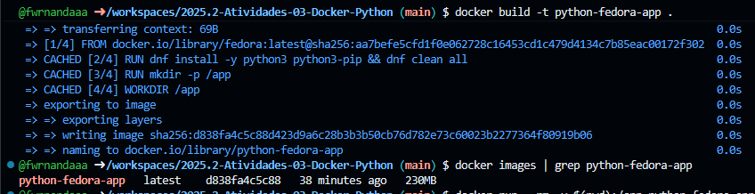
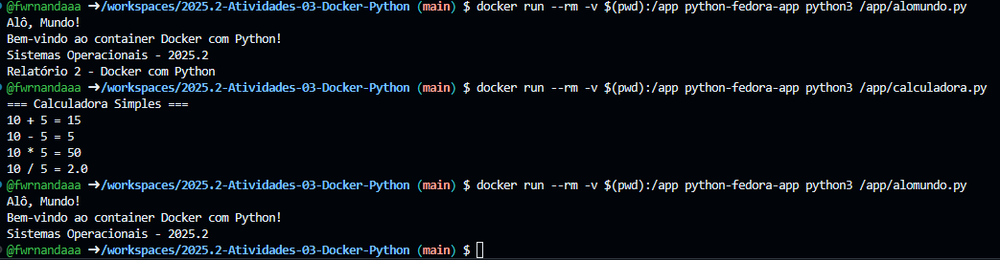

# Relatório de atividade 03 - Sistemas operacionais

Aluna: Fernanda Dantas do Nascimento

Data: 25/10/2025

# Introdução
Este relatório tem como objetivo mostrar como utilizar o Docker para executar aplicações Python dentro do Docker. Além disso, a atividade também envolveu a instalação e execução de arquivos Python dentro do container.

# Relato

### Passo 1
Após criar todos os arquivos Python solicitados na descrição da atividade e adicionar todos os comandos necessários para configurar o ambiente do arquivo Dockerfille, construí a imagem Docker com o comando:

*docker build -t python-fedora-app .*

Em seguida, verifiquei se a imagem havia sido devidamente criada

### Passo 2

Após a configuração do ambiente, rodei o comando de execução do container criado: 

Execução dos arquivos .py:

### Passo 3 - Prática 
As alterações feitas no arquivo foram atualizadas imediatamente no container, o que confirma que o mapeamento do volume estáfuncionando corretamente.

### Passo 4 - Construir e executar o container
 #### 4.1 Construção e visualização da imagem Docker.

 #### 4.2 Modificações nos arquivos

 

 Assim como na prática anterior, percebemos que atualizações feitas no arquivo são refletidas imediatamente.

 # Conclusão

Para essa atividade, enfrentei algumas dificuldades relacionadas a qual comando eu deveria executar dentro do container e quais deveria executar no host. Com o tempo, consegui compreender a diferença entre criar a imagem com docker build (feito no host) e executar o container com docker run(que deve estar dentro do arquivo Dockerfille). 

A atividade também exemplificou bem como funciona o mapeamento de volume no Docker, uma vez que foi possível verificar como as alterações feitas nos arquivos do host são refletidas imediatamente dentro do container.